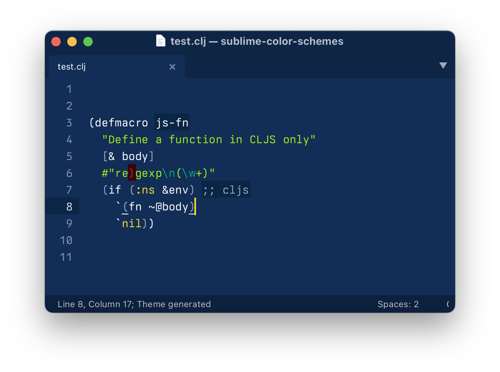
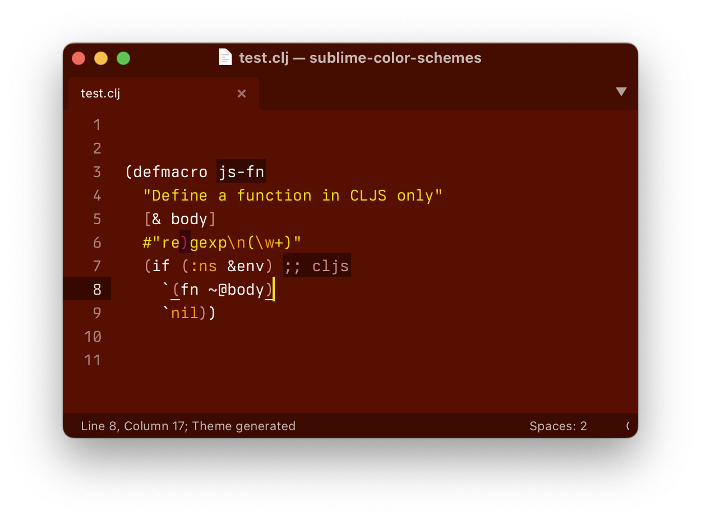
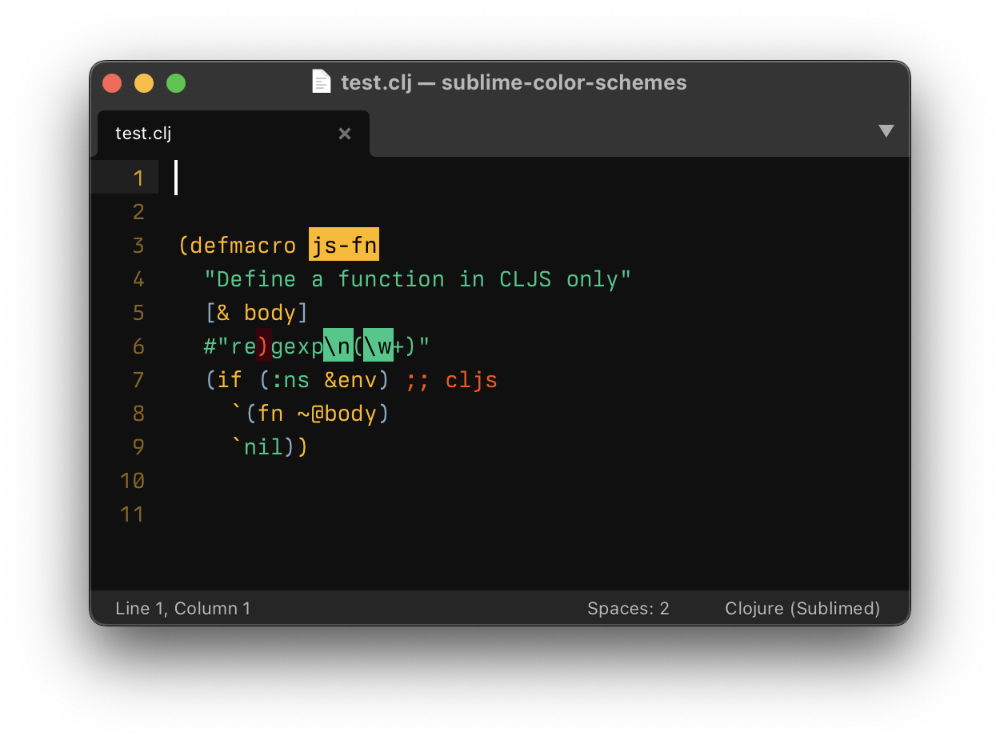

Some fun color schemes for Sublime Text

# Schemes

Blue:



Red:



Berkeley:



# Installation

```bash
git clone \
  https://github.com/tonsky/sublime-color-schemes.git \
  ~/Library/Application\ Support/Sublime\ Text/Packages/sublime-color-schemes
```